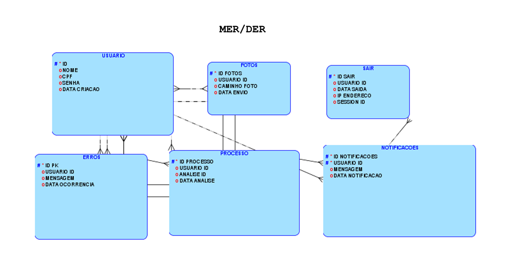
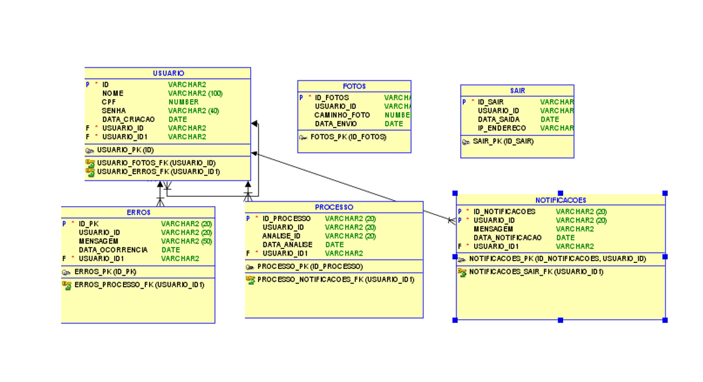

<h1>Revolucionando o Mercado Odontológico</h1>

<h2>Integrantes do Grupo</h2>
<ul>
  <li><strong>Herbert Santos</strong> 
    <em>Responsabilidade</em>: Desenvolvimento das entidades, persistência com JPA/Hibernate, desenvolvimento de DTOs, modelos e algumas entidades de controller.
  </li>
  <li><strong>Enzo Franco</strong> 
    <em>Responsabilidade</em>: Implementação das classes de serviço e do <code>ErroController</code>.
  </li>
  <li><strong>João Pedro</strong> 
    <em>Responsabilidade</em>: Diagrama de classes, DER e configuração do banco de dados.
  </li>
</ul>

<h2>Instruções para Rodar a Aplicação</h2>
<h3>Pré-requisitos</h3>
<ul>
  <li>JDK 17 ou superior</li>
  <li>Maven instalado</li>
  <li>Banco de dados Oracle ou outro banco de dados relacional configurado</li>
</ul>

<h3>Passos para Rodar:</h3>
<ol>
  <li>Clone o repositório do GitHub:
    <pre><code>git clone https://github.com/seu-usuario/repositorio.git</code></pre>
  </li>
  <li>Navegue até a pasta do projeto:
    <pre><code>cd nome-do-projeto</code></pre>
  </li>
  <li>Configure as credenciais do banco de dados no arquivo <code>application.properties</code>:
    <pre><code>
spring.datasource.url=jdbc:oracle:thin:@localhost:1521:XE
spring.datasource.username=seu-usuario
spring.datasource.password=sua-senha
spring.jpa.hibernate.ddl-auto=update
    </code></pre>
  </li>
  <li>Compile o projeto:
    <pre><code>mvn clean install</code></pre>
  </li>
  <li>Execute a aplicação:
    <pre><code>mvn spring-boot:run</code></pre>
  </li>
  <li>Acesse a aplicação através da URL:
    <a href="http://localhost:8081">http://localhost:8081</a>
  </li>
</ol>

<h2>Diagramas</h2>
<h3>Diagrama de Classes</h3>

<h3>Diagrama de Entidade-Relacionamento (DER)</h3>

<h2>Vídeo de Apresentação</h2>

Você pode acessar o vídeo de apresentação da proposta tecnológica, o público-alvo da aplicação e os problemas que a aplicação se propõe a solucionar no link abaixo:

<a href="https://youtu.be/Xg01iNC5zSs?si=pBmGElipfNv43P2c">Link para o vídeo de apresentação</a>

# Lista de Endpoints para testar no Postman

Abaixo estão os endpoints disponíveis para testar os controladores fornecidos, usando o endereço base `http://localhost:8081`.

## Endpoints de Usuários
- **GET** `/usuarios`: Retorna a lista de todos os usuários.
- **GET** `/usuarios/{id}`: Retorna um usuário específico pelo ID.
- **POST** `/usuarios`: Cria um novo usuário.
- **PUT** `/usuarios/{id}`: Atualiza um usuário existente.
- **DELETE** `/usuarios/{id}`: Deleta um usuário existente.

## Endpoints de Processos
- **GET** `/processo`: Retorna a lista de todos os processos.
- **GET** `/processo/{id}`: Retorna um processo específico pelo ID.
- **POST** `/processo`: Cria um novo processo.
- **PUT** `/processo/{id}`: Atualiza um processo existente.
- **DELETE** `/processo/{id}`: Deleta um processo existente.

## Endpoints de Notificações
- **GET** `/notificacoes`: Retorna a lista de todas as notificações.
- **GET** `/notificacoes/{id}`: Retorna uma notificação específica pelo ID.
- **POST** `/notificacoes`: Cria uma nova notificação.
- **PUT** `/notificacoes/{id}`: Atualiza uma notificação existente.
- **DELETE** `/notificacoes/{id}`: Deleta uma notificação existente.

## Endpoints de Fotos
- **GET** `/fotos`: Retorna a lista de todas as fotos.
- **GET** `/fotos/{id}`: Retorna uma foto específica pelo ID.
- **POST** `/fotos`: Cria uma nova foto.
- **PUT** `/fotos/{id}`: Atualiza uma foto existente.
- **DELETE** `/fotos/{id}`: Deleta uma foto existente.

## Endpoints de Erros
- **GET** `/erros`: Retorna a lista de todos os erros.
- **GET** `/erros/{id}`: Retorna um erro específico pelo ID.
- **POST** `/erros`: Cria um novo erro.
- **PUT** `/erros/{id}`: Atualiza um erro existente.
- **DELETE** `/erros/{id}`: Deleta um erro existente.

